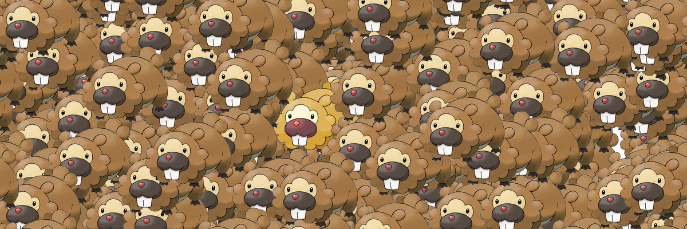

# Image tiling utility

Simple script to paste PNGs together into a tilable image similar to this :

## Usage

Change the settings at the top of the file, and run it.
You can add or remove as many different images as you need.

The seed is used to get reproducible output, change it each time for different images or set it to -1.

## Requirements

 - Pillow

Run ``pip install Pillow``
